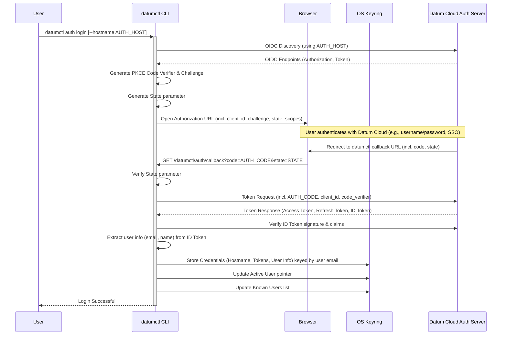

`datumctl` utilizes OAuth 2.0 Authorization Code Flow with PKCE (Proof Key for
Code Exchange) for user authentication. This flow is orchestrated by the
`datumctl auth login` command and leverages OpenID Connect (OIDC) for
discovering provider endpoints and verifying user identity.

## Login process (`datumctl auth login`)

The following diagram illustrates the sequence of events during login:

**Key steps:**

1.  **Discovery:** `datumctl` uses the provided `--hostname` (or default) to
    perform OIDC discovery and find the necessary authorization and token
    endpoints.
2.  **PKCE Generation:** A cryptographically random `code_verifier` is
    generated. A SHA256 hash of this verifier creates the `code_challenge`,
    which is sent in the authorization request.
3.  **Authorization Request:** The user's browser is directed to the Datum
    Cloud authorization endpoint with parameters including the `client_id`,
    `code_challenge`, `code_challenge_method=S256`, `state` (for CSRF
    protection), and requested `scopes` (openid, profile, email,
    offline_access).
4.  **User Authentication:** The user authenticates directly with the Datum
    Cloud Auth Server via the browser.
5.  **Callback:** The Auth Server redirects the browser back to a local HTTP
    server temporarily run by `datumctl`
    (`http://localhost:8085/datumctl/auth/callback`). The redirect includes the
    `authorization_code` and the original `state`.
6.  **State Verification:** `datumctl` verifies that the received `state`
    matches the one it generated.
7.  **Token Exchange:** `datumctl` makes a POST request to the token endpoint,
    exchanging the `authorization_code` for tokens. Crucially, it includes the
    original `code_verifier`. The Auth Server hashes this verifier and compares
    it to the `code_challenge` sent in step 3 to ensure the request comes from
    the same client.
8.  **Token Storage:** Upon successful exchange, `datumctl` receives an access
    token, a refresh token (due to the `offline_access` scope), and an ID
    token.
9.  **ID Token Verification:** The ID token (a JWT) is verified:
    *   Signature is checked against the provider's public keys (obtained
        during discovery).
    *   Claims like `iss` (issuer), `aud` (audience/client\_id), `exp` (expiry),
        `iat` (issued at) are validated.
    *   User information (email, name) is extracted from the claims.
10. **Keyring Storage:** The complete set of credentials
    (`authutil.StoredCredentials`), including the tokens, hostname, client ID,
    endpoints, scopes, and user info, is marshalled to JSON and stored
    securely in the OS keyring. The key for this entry is the user's email
    address.
11. **Active User:** A pointer (`active_user`) is also stored in the keyring,
    indicating which user's credentials should be used by default.
12. **Known Users:** The user's key (email) is added to a list (`known_users`)
    in the keyring to facilitate listing and multi-user management.

## Token refresh & usage

When commands like `datumctl organizations list` or
`datumctl auth get-token` need to authenticate API calls:

1.  They call `authutil.GetTokenSource()`.
2.  `GetTokenSource` retrieves the *active* user's `StoredCredentials` from the
    keyring.
3.  It configures an `oauth2.Config` using the stored Client ID and Token
    Endpoint.
4.  It creates an `oauth2.TokenSource` initialized with the stored token
    (access + refresh).
5.  The standard Go `oauth2` library uses this `TokenSource`:
    *   If the access token is valid, it's used directly.
    *   If the access token is expired, the library automatically uses the
        refresh token and the `oauth2.Config` to request a new access token
        from the token endpoint (Refresh Token Grant).
    *   If the refresh is successful, the new token is used, and `datumctl`
        attempts to update the stored token in the keyring
        (`internal/cmd/auth/get_token.go`).

## Keyring interaction

*   The `internal/keyring` package provides a wrapper around
    `github.com/zalando/go-keyring`.
*   The `internal/authutil` package defines constants for the service name
    (`datumctl-auth`) and keys (`active_user`, `known_users`, `<user-email>`)
    used within the keyring.
*   `authutil.StoredCredentials` is the structure marshalled into JSON for
    storage.

## Hostname derivation

For commands that interact with the Datum Cloud API (not the auth server), the
API hostname is needed (e.g., `api.datum.net`).

*   The `login` command stores the *authentication* hostname (`auth.datum.net`)
    in the keyring.
*   Commands needing the API hostname call `authutil.GetActiveCredentials` to
    retrieve the stored auth hostname.
*   They then call `authutil.DeriveAPIHostname`, which currently implements a
    simple logic: if the auth hostname starts with `auth.`, it replaces it with
    `api.`.
*   If derivation fails, an error is returned, preventing the use of
    potentially incorrect default hostnames.
